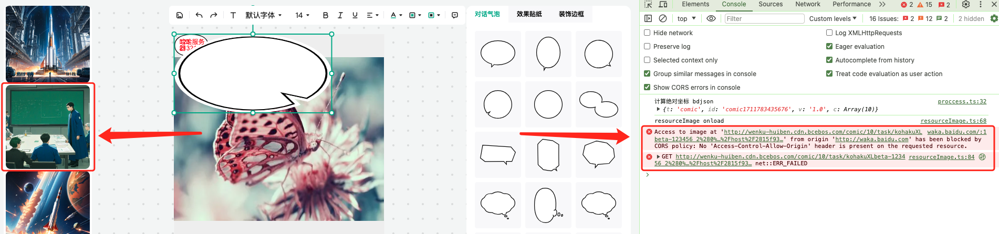
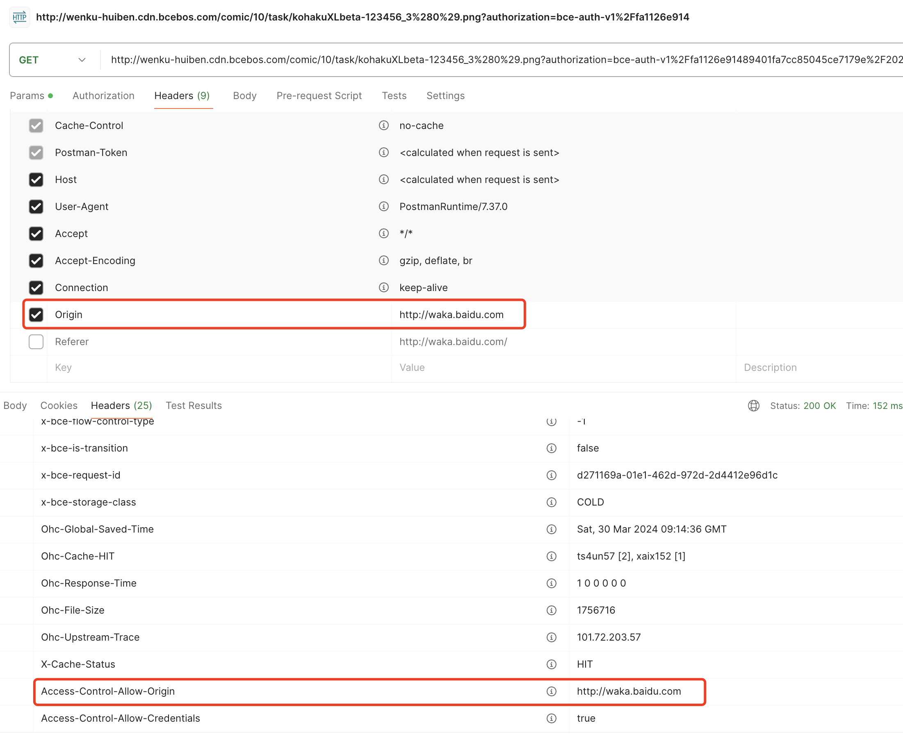

# JS new Image 加载跨域图片

## 问题描述

图片服务器设置了允许 CORS 跨域请求，但是响应头中的 Access-Control-Allow-Origin 不是 *，而是具体的域名，例如 baidu.com

左侧使用 div 的 background-image 属性设置图片，中间使用 Canvas 绘制图片（JS new Image 的方式）

中间 Canvas 中的图片会提示跨域请求失败，而左侧 div 中的图片可以正常加载



使用 PostMan 测试图片请求，发现请求头中已经包含 Origin 字段，且响应里已经返回带有 Access-Control-Allow-Origin 的响应头



那为什么还会报跨域失败呢？

## 原因

如果图片已经被加载（例如作为背景图片），再次使用它并设置 crossOrigin 可能不会生效，因为图片已经被缓存而不带 CORS 头部

因为左侧的 div 图片已经加载，所以在 Canvas 请求的时候，浏览器会使用缓存的图片，而缓存的图片没有 CORS 头部，所以会报跨域错误

## 解决方案

给 url 添加随机参数，例如时间戳；让浏览器重新加载图片，而不是使用缓存的图片

将

```js
img.src = url;
```

改为

```js
img.src = url + `${url.indexOf('?') === -1 ? '?' : '&'}timestamp=${new Date().getTime()}`;
```

效果如下：


